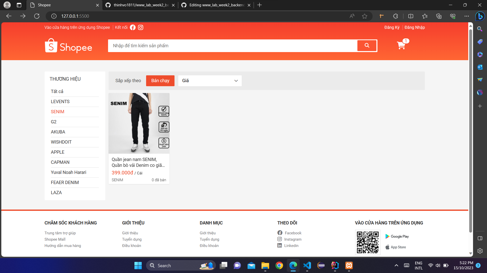
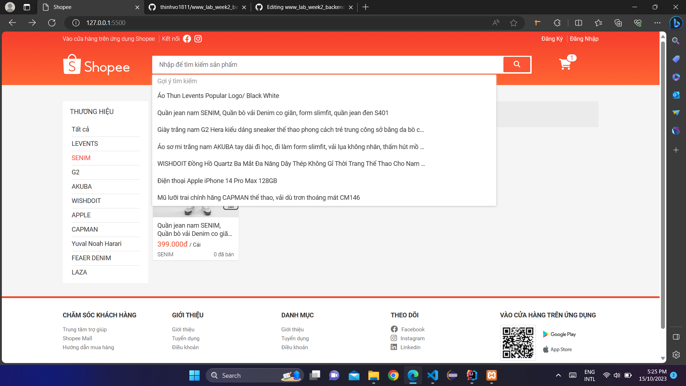
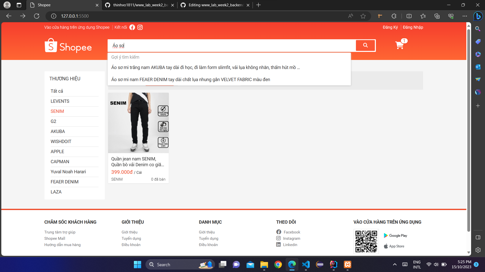
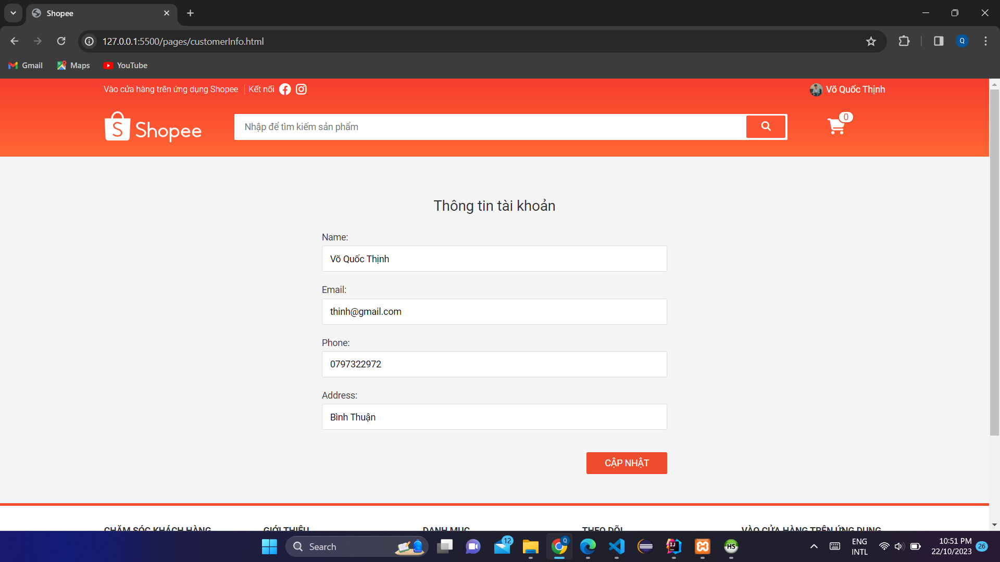
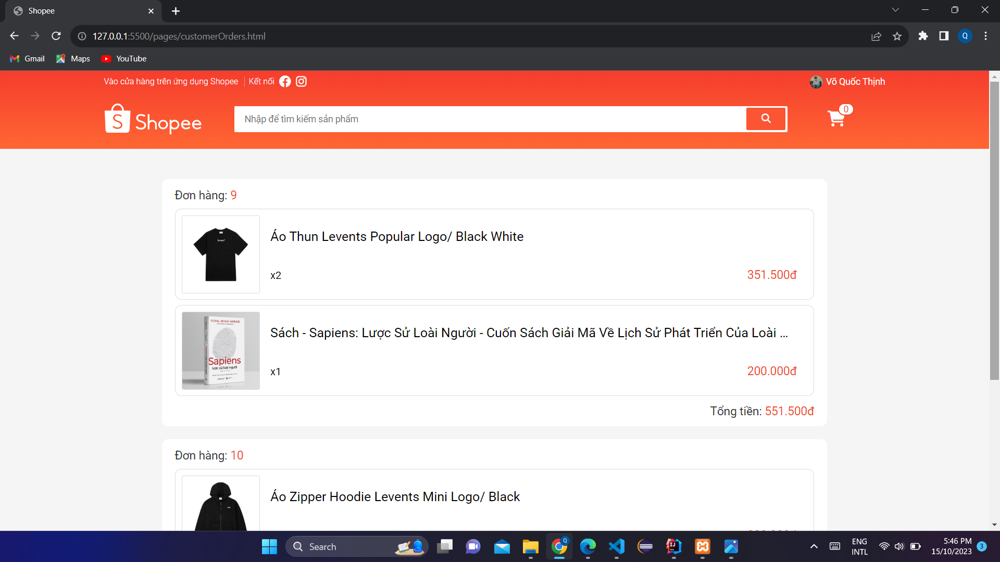

## Giới thiệu:
- ✍ Môn học: Lập trình WWW (Java)
- ✍ Chủ đề: Bài tập tuần 02
 

## Đề bài:

 

## Bài làm:

1. Giao diện chính của trang web

- ✍ Hiển thị danh sách các sản phẩm được lưu dưới database với mỗi sản phẩm bao gồm tên, hình ảnh, giá, đơn vị, thương hiệu và số lượng đã bán

- ✍ Có thể chọn lọc ra danh sách sản phẩm theo tên thương hiệu

- ✍ Khi click vào ô tìm kiếm thì sẽ hiển thị ra danh sách các tên sản phẩm (Chỉ hiển thị tối đa 7 tên do đã đặt kích thước tối đa cho thẻ div chứa danh sách này)

- ✍ Các tên quá dài sẽ bị ẩn bớt và thay bằng dấu ...

- ✍ Khi gõ tên sản phẩm muốn tìm thì danh sách sẽ hiển thị những tên có liên quan

2. Chức năng đăng ký

- ✍ Khi chọn đăng ký sẽ hiển thị form đăng ký (Chỉ đăng ký được tài khoản khách hàng)

- ✍ Trên góc phải của form đăng ký có nút đăng nhập để chuyển sang form đăng nhập (Ở form đăng nhập cũng có nút đăng ký tương tự)

- ✍ Khi nhập sai định dạng hoặc không nhập sẽ báo lỗi tương ứng với ô bị lỗi (các form khác trên trang web cũng có kiểm tra valid cho các ô tương tự)

- ✍ Khi đăng ký với tài khoản email đã tồn tại thì sẽ thông báo cho người dùng

- ✍ Khi đăng ký thành công sẽ thông báo thành công

2. Chức năng đăng nhập cho khách hàng

- ✍ Khi đăng ký thành công sẽ tự động chuyển sang form đăng nhập hoặc khi chọn đăng nhập trên thanh navbar cũng có kết quả tương tự

- ✍ Chỉ đăng nhập bằng email và số điện thoại (Vì database được thiết kế không có mật khẩu cho cả khách hàng và nhân viên)

- ✍ Có 2 nút đăng nhập, 1 cho khách hàng và 1 cho nhân viên nên nếu tài khoản khách hàng mà chọn đăng nhập cho nhân viên thì sẽ không được và ngược lại

- ✍ Khi nhập email hoặc số điện thoại không chính xác thì sẽ báo lỗi cho người dùng

- ✍ Khi đăng nhập cho khách thành công thì sẽ chuyển navbar đăng ký và đăng nhập sang tên người đăng nhập

- ✍ Đồng thời cũng setItem('USER') cho SessionStorage là thông tin người đăng nhập (Item này chỉ mất khi chủ động xóa hoặc tắt tab đó)

- ✍ Vì điều kiện để hiển thị tên người đăng nhập trên thanh navbar là phải có Item('USER') nên dù cho load lại trang web bao nhiêu thì tên người đăng nhập trên thanh navbar vẫn không bị mất (Trừ khi tắt tab và mở lại)

- ✍ Khi hover vào tên khách hàng thì sẽ hiển thị các chức năng dành cho khách hàng bao gồm tài khoản của tôi, đơn mua và đăng xuất

- ✍ Khi chọn chức năng tài khoản của tôi sẽ hiển thị toàn bộ thông tin cá nhân của khách hàng

- ✍ Khách hàng có thể cập nhật lại thông tin của mình

- ✍ Khi chọn chức năng đơn mua sẽ hiển thị toàn bộ các đơn hàng đã mua của khách hàng 

- ✍ Vì tài khoản này mới đăng ký nên chưa có đơn mua nào 

- ✍ Đối với những khách hàng đã có đơn mua thì sẽ hiển thị danh sách các đơn hàng. Trong mỗi đơn hàng lại chứa danh sách các chi tiết đơn hàng của nó

- ✍ Khi chọn chức năng đăng xuất thì sẽ chuyển ra lại giao diện chính

- ✍ Đồng thời cũng removeItem('USER') trong SessionStorage vì vậy nên sẽ mất tên người dùng trên thanh navbar và hiển thị lại nút đăng ký, đăng nhập

3. Chức năng đăng nhập cho nhân viên

- ✍ Trong form đăng nhập nếu chúng ta chọn đăng nhập cho nhân viên với tài khoản nhân viên chính xác thì cũng sẽ hiển thị tên nhân viên trên thanh navbar tương tự như khách hàng

- ✍ Đồng thời khi hover vào tên nhân viên cũng hiển thị các chức năng dành cho nhân viên như tài khoản của tôi, quản lý nhân viên, khách hàng, sản phẩm, đơn hàng và đăng xuất

