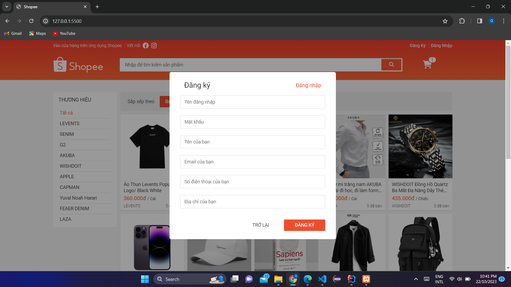
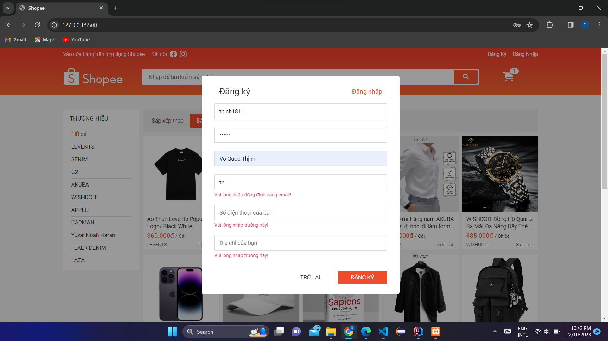
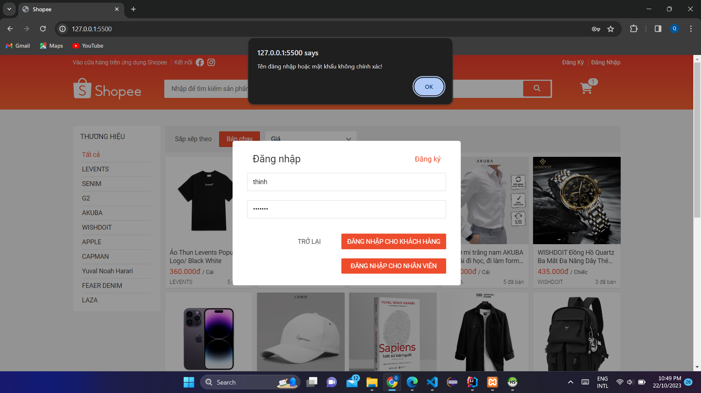
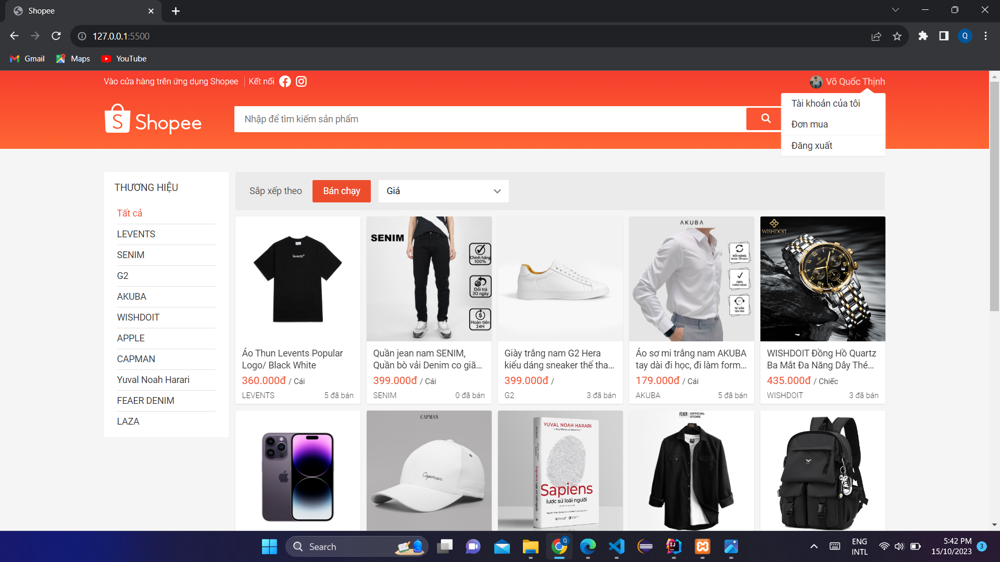
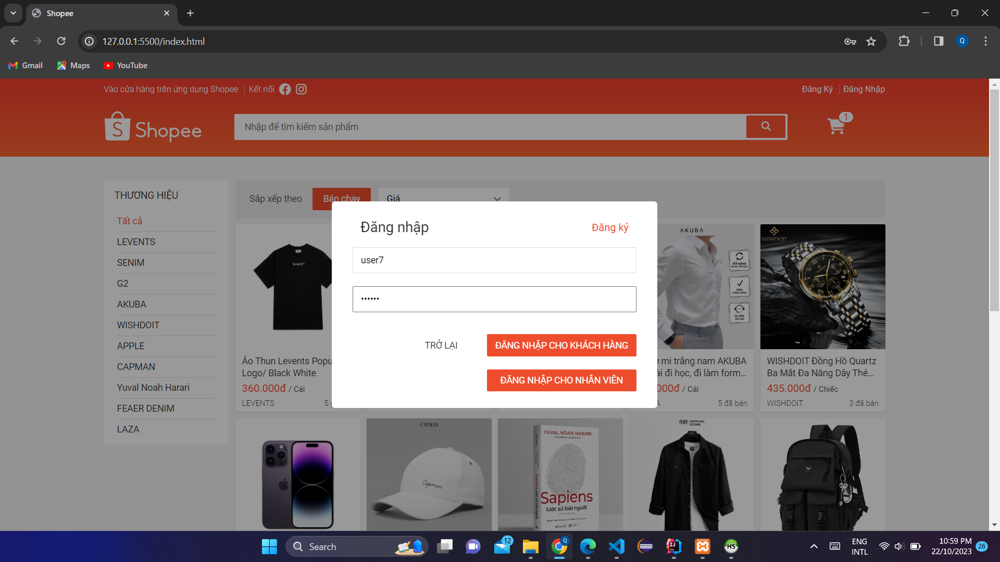

## Giới thiệu:
- ✍ Môn học: Lập trình WWW (Java)
- ✍ Chủ đề: Bài tập tuần 02
 

## Đề bài:

 

## Bài làm:

1. Chức năng hiển thị danh sách sản phẩm

- ✍ Hiển thị danh sách các sản phẩm được lưu dưới database với mỗi sản phẩm bao gồm tên, hình ảnh, giá, đơn vị, thương hiệu và số lượng đã bán

- ✍ Có thể chọn lọc ra danh sách sản phẩm theo tên thương hiệu

2. Chức năng tìm kiếm

- ✍ Khi click vào ô tìm kiếm thì sẽ hiển thị ra danh sách các tên sản phẩm (Chỉ hiển thị tối đa 7 tên do đã đặt kích thước tối đa cho thẻ div chứa danh sách này)

- ✍ Các tên quá dài sẽ bị ẩn bớt và thay bằng dấu ...

- ✍ Khi gõ tên sản phẩm muốn tìm thì danh sách sẽ hiển thị những tên có liên quan

3. Chức năng hiển thị chi tiết sản phẩm

- ✍ Khi click vào một sản phẩm (vào thẻ sản phẩm hoặc tên sản phẩm trên ô tìm kiếm đều có kết quả tương tự) bất kì sẽ hiển thị chi tiết của sản phẩm đó

- ✍ Có thể chuyển các hình ảnh khác của sản phẩm để xem

4. Chức năng thêm vào giỏ hàng

- ✍ Khi chọn thêm vào giỏ hàng thì số lượng sản phẩm trong giỏ hàng sẽ thay đổi, đồng thời cũng chứa sản phẩm mà mình vừa thêm

- ✍ Nếu chưa đăng nhập thì sẽ lưu vào giỏ hàng mặc định (lưu bằng localStorage vì database không có giỏ hàng) và nếu đã đăng nhập thì sẽ lưu vào giỏ hàng theo id của khách hàng

- ✍ Sở dĩ có thể thêm vào giỏ hàng khi chưa đăng nhập là vì chỉ khi nào mua hàng mới cần thiết đến thông tin người mua

- ✍ Khi chọn xóa thì sẽ xóa sản phẩm đó ra khỏi giỏ hàng

5. Chức năng đăng ký

- ✍ Khi chọn đăng ký sẽ hiển thị form đăng ký (Chỉ đăng ký được tài khoản khách hàng)

- ✍ Trên góc phải của form đăng ký có nút đăng nhập để chuyển sang form đăng nhập (Ở form đăng nhập cũng có nút đăng ký tương tự)

- ✍ Khi nhập sai định dạng hoặc không nhập sẽ báo lỗi tương ứng với ô bị lỗi (các form khác trên trang web cũng có kiểm tra valid cho các ô tương tự)

- ✍ Khi đăng ký với tài khoản email đã tồn tại thì sẽ thông báo cho người dùng

- ✍ Khi đăng ký thành công sẽ thông báo thành công

6. Chức năng đăng nhập cho khách hàng

- ✍ Khi đăng ký thành công sẽ tự động chuyển sang form đăng nhập hoặc khi chọn đăng nhập trên thanh navbar cũng có kết quả tương tự

- ✍ Có 2 nút đăng nhập, 1 cho khách hàng và 1 cho nhân viên nên nếu tài khoản khách hàng mà chọn đăng nhập cho nhân viên thì sẽ không được và ngược lại

- ✍ Khi nhập tên đăng nhập hoặc mật khẩu không chính xác thì sẽ báo lỗi cho người dùng

- ✍ Khi đăng nhập cho khách thành công thì sẽ chuyển navbar đăng ký và đăng nhập sang tên người đăng nhập

- ✍ Đồng thời cũng setItem('USER') cho SessionStorage là thông tin người đăng nhập (Item này chỉ mất khi chủ động xóa hoặc tắt tab đó)

- ✍ Vì điều kiện để hiển thị tên người đăng nhập trên thanh navbar là phải có Item('USER') nên dù cho load lại trang web bao nhiêu thì tên người đăng nhập trên thanh navbar vẫn không bị mất (Trừ khi tắt tab và mở lại)

- ✍ Khi hover vào tên khách hàng thì sẽ hiển thị các chức năng dành cho khách hàng bao gồm tài khoản của tôi, đơn mua và đăng xuất

7. Chức năng hiển thị thông tin tài khoản của khách hàng và cập nhật thông tin

- ✍ Khi chọn chức năng tài khoản của tôi sẽ hiển thị toàn bộ thông tin cá nhân của khách hàng

- ✍ Khách hàng có thể cập nhật lại thông tin của mình

- ✍ Khi cập nhật email trùng với một email đã được đăng kí sẽ báo lỗi

- ✍ Khi cập nhật thành công sẽ thông báo thành công

8. Chức năng hiển thị đơn mua của khách hàng

- ✍ Khi chọn chức năng đơn mua sẽ hiển thị toàn bộ các đơn hàng đã mua của khách hàng 

- ✍ Vì tài khoản này mới đăng ký nên chưa có đơn mua nào 

- ✍ Đối với những khách hàng đã có đơn mua thì sẽ hiển thị danh sách các đơn hàng. Trong mỗi đơn hàng lại chứa danh sách các chi tiết đơn hàng của nó

- ✍ Khi ở trong các trang này thì chúng ta vẫn có thể thực hiện các chức năng khác như tìm kiếm sản phẩm, xem giỏ hàng,... như bình thường

9. Chức năng đăng xuất

- ✍ Khi chọn chức năng đăng xuất thì sẽ chuyển ra lại giao diện chính

- ✍ Đồng thời cũng removeItem('USER') trong SessionStorage vì vậy nên sẽ mất tên người dùng trên thanh navbar và hiển thị lại nút đăng ký, đăng nhập

10. Chức năng đăng nhập cho nhân viên

- ✍ Trong form đăng nhập nếu chúng ta chọn đăng nhập cho nhân viên với tài khoản nhân viên chính xác thì cũng sẽ hiển thị tên nhân viên trên thanh navbar tương tự như khách hàng

- ✍ Đồng thời khi hover vào tên nhân viên cũng hiển thị các chức năng dành cho nhân viên như thống kê đơn hàng, vẽ biểu đồ giá và đăng xuất

11. Chức năng thống kê đơn hàng

- ✍ Khi chọn chức năng thống kê đơn hàng sẽ hiển thị giao diện như sau

- ✍ Chức năng thống kê bao gồm theo ngày, theo khoảng thời gian và theo nhân viên trong khoảng thời gian

- ✍ Khi chọn thống kê theo ngày sẽ hiển thị ô chọn ngày và nút thống kê

- ✍ Khi chưa chọn ngày mà click nút thống kê sẽ thông báo yêu cầu người dùng chọn ngày

- ✍ Khi chọn ngày và click nút thống kê sẽ hiển thị danh sách đơn hàng của ngày đã chọn

- ✍ Đồng thời cũng tính tổng tất cả đơn hàng trong danh sách đó

- ✍ Khi chọn thống kê theo khoảng thời gian và nhân viên trong khoảng thời gian cũng được thực hiện tương tự

12. Chức năng vẽ biểu đồ giá

- ✍ Khi chọn chức năng vẽ biểu đồ giá sẽ hiển thị giao diện như sau

- ✍ Khi chọn sản phẩm (các id sản phẩm được lấy qua api) và click nút vẽ biểu đồ thì một biểu đồ giá của sản phẩm đó sẽ được hiển thị

